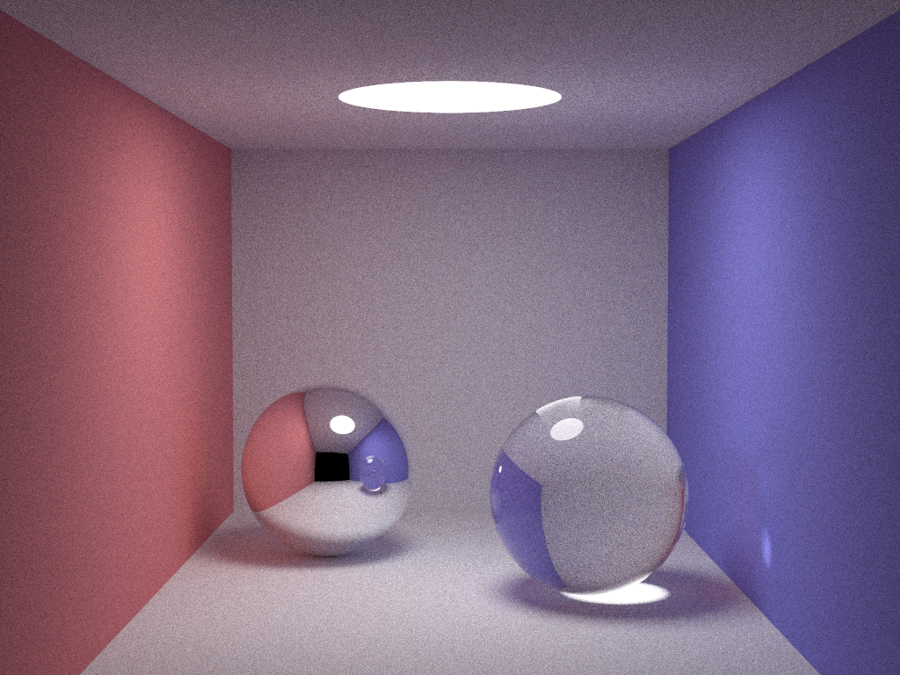

[![License][s1]][li]

[s1]: https://img.shields.io/badge/licence-GPL%203.0-blue.svg
[li]: https://raw.githubusercontent.com/matt77hias/smallpt/master/LICENSE.txt

# smallpt

## About
The Rosetta smallpt project: the same path tracer (modifications of Kevin Baeson's [99 line C++ path tracer](http://www.kevinbeason.com/smallpt/)) written in multiple languages.

**Note**: I deliberately chose for the same software design for [all programming languages](https://github.com/matt77hias/smallpt) out of clarity and performance reasons (this can conflict with the nature of declarative/functional programming languages).

## Features
**Current languages**:

* [C](https://github.com/matt77hias/c-smallpt)
  * single threaded
  * multi threaded (OpenMP)
* [C++](https://github.com/matt77hias/cpp-smallpt)
  * single threaded
  * multi threaded (Windows Threads)
  * multi threaded (OpenMP)
* [C#](https://github.com/matt77hias/cs-smallpt)
  * single threaded
  * multi threaded
* [CoffeeScript](https://github.com/matt77hias/coffee-smallpt)
* [CUDA](https://github.com/matt77hias/cu-smallpt)
* [Erlang](https://github.com/matt77hias/erl-smallpt)
* [GLSL](https://www.shadertoy.com/view/MlcczX)
* [Haskell](https://github.com/matt77hias/hs-smallpt)
* [Java](https://github.com/matt77hias/java-smallpt)
* [JavaScript](https://github.com/matt77hias/js-smallpt)
* [J#](https://github.com/matt77hias/jsl-smallpt)
* [Prolog](https://github.com/matt77hias/pl-smallpt)
* [Python 2.7](https://github.com/matt77hias/py-smallpt)
* [Python 3.5](https://github.com/matt77hias/py-smallpt)
* [Python 2.7 + NumPy](https://github.com/matt77hias/numpy-smallpt)
* [Python 3.5 + NumPy](https://github.com/matt77hias/numpy-smallpt)
* [Racket](https://github.com/matt77hias/rkt-smallpt)
* [TypeScript](https://github.com/matt77hias/ts-smallpt)

**Possible future languages**:
* Constexpr C++, Julia, Cython, Lua, F#, Fortran, Matlab/Octave, R5RS/R6RS, Lisp, etc.

(Currently I am not able to build J++ and P#/C#)

## Performance comparison
In order to give a very rough performance comparison, the wall clock time is measured of a single run to generate an image of resolution 1024x768 using 64spp. All single process - single threads experiments output the current progression to standard output. All multi process - multi threaded experiments do not output the current progression to standard output (this can change in the future).

**System**:
* OS: Windows 8.1 Pro 64 Bit
* CPU: Intel i7-4770K @ 3,50 GHz (TB @ 3,9 GHz) with 8GB DDR3 @ 1600 MHz
* GPU: NVIDIA GeForce GTX 970 with 4 GB GDDR5

**Note**: the random number generators used, differ between the languages and their implementations. It makes no sense to use the same random number generator in all implementations (i.e. C++ vs CUDA) and would introduce a huge burden to explicitly pass the state in languages such as Prolog.

### Single process - Single threaded

| Programming Language                                                | Compiler/Interpreter         | Wall clock (64 spp) |
|---------------------------------------------------------------------|------------------------------|---------------------|
| [C](https://github.com/matt77hias/c-smallpt)                        | MSVC++ 15.5.9                | 00h 01m 51.88s      |
| [C++](https://github.com/matt77hias/cpp-smallpt)                    | MSVC++ 15.5.9                | 00h 01m 21.32s      |
| [C#](https://github.com/matt77hias/cs-smallpt)                      | CLR 4.6.1055.0               | 00h 01m 30.56s      |  
| [CoffeeScript](https://github.com/matt77hias/coffee-smallpt)        | CC 1.11.1/Chrome             | 00h 04m 19.63s      |
| [Erlang](https://github.com/matt77hias/erl-smallpt)                 | ERTS/BEAM 8.0                | 00h 59m 45.30s      |
| [Haskell](https://github.com/matt77hias/hs-smallpt)                 | GHC 8.0.1                    | 00h 10m 35.55s      |
| [Haskell](https://github.com/matt77hias/hs-smallpt)                 | GHCi 8.0.1                   | 02h 14m 54.00s      |
| [Java](https://github.com/matt77hias/java-smallpt)                  | JVM 1.8                      | 00h 01m 47.89s      |
| [JavaScript](https://github.com/matt77hias/js-smallpt)              | Chrome                       | 00h 06m 27.63s      |
| [J#](https://github.com/matt77hias/jsl-smallpt)                     | CLR 14.00                    | 00h 06m 14.62s      |
| [Prolog](https://github.com/matt77hias/pl-smallpt)                  | SWI-Prolog 7.2.3             | /                   |
| [Python 2.7](https://github.com/matt77hias/py-smallpt)              | CPython (Anaconda 4.1.12)    | 08h 24m 40.88s      |
| [Python 2.7](https://github.com/matt77hias/py-smallpt)              | CPython (Canopy 1.5.2)       | 08h 35m 03.19s      |
| [Python 2.7](https://github.com/matt77hias/py-smallpt)              | IronPython 2.7.6             | 06h 32m 11.48s      |
| [Python 2.7](https://github.com/matt77hias/py-smallpt)              | PyPy 5.6.0                   | 00h 20m 47.33s      |
| [Python 3.5](https://github.com/matt77hias/py-smallpt)              | CPython (Anaconda 4.1.12)    | 09h 37m 05.13s      |
| [Python 2.7 + NumPy](https://github.com/matt77hias/numpy-smallpt)   | CPython (Anaconda 4.1.12)    | 09h 58m 25.18s      |
| [Python 2.7 + NumPy](https://github.com/matt77hias/numpy-smallpt)   | CPython (Canopy 1.5.2)       | 10h 43m 04.10s      |
| [Python 3.5 + NumPy](https://github.com/matt77hias/numpy-smallpt)   | CPython (Anaconda 4.1.12)    | 10h 20m 46.47s      |
| [Racket](https://github.com/matt77hias/rkt-smallpt)                 | DrRacket 6.6                 | 00h 49m 39.43s      |
| [TypeScript](https://github.com/matt77hias/ts-smallpt)              | TSC 2.0.10/Chrome            | 00h 08m 10.58s      |

### Multi process - Multi threaded

| Programming Language                                                | Compiler/Interpreter         | Wall clock (64 spp) |
|---------------------------------------------------------------------|------------------------------|---------------------|
| [C + OpenMP](https://github.com/matt77hias/c-smallpt)               | MSVC++ 15.5.9                | 00h 00m 22.09s      |
| [C++](https://github.com/matt77hias/cpp-smallpt)                    | MSVC++ 15.5.9                | 00h 00m 16.71s      |
| [C++ + OpenMP](https://github.com/matt77hias/cpp-smallpt)           | MSVC++ 15.5.9                | 00h 00m 25.97s      |
| [C#](https://github.com/matt77hias/cs-smallpt)                      | CLR 4.6.1055.0               | 00h 00m 24.16s      | 
| [CUDA](https://github.com/matt77hias/cu-smallpt)                    | MSVC++ 15.5.9/NVCC 9.2       | 00h 00m 07.89s      |

### Panorma (old version)

